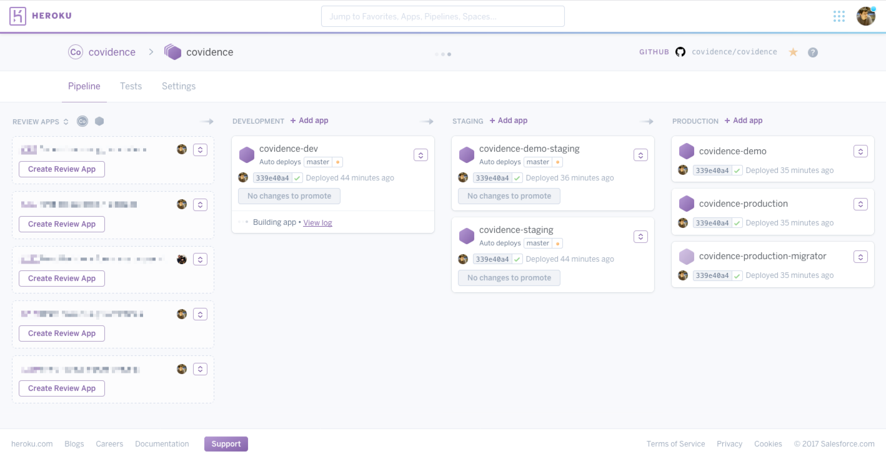

To get the most out of staging environments, it is important to have production
quality data (in both variety and size) at your disposal to identify potential
production problems before your customers do. For example, good data allows
developers to check that new features behave as expected with real-world data,
that a bugfix actually fixes a bug for a known scenario, or to benchmark a
database migration or the performance of new code.

Like many technology companies, at [Covidence](https://www.covidence.org) we
use staging environment in a number of these critical ways, and more. In fact,
we actually use several different staging environments, some persistent and
some temporary.



### Production Deployments

In production, we run two main deployments: `production` and `demo`. Our
`production` environment is... just that. Our `demo` environment is version of
our application that acts as a kind of playground for potential customers to
evaluate our product or for existing customers to learn or experiment with the
product without risking their production data. Data in this environment is
expunged on a rolling basis.

### Non-production Deployments

In staging, we have one environment each to mirror the production versions:
`staging` and `demo-staging`. These two deployments automatically get the
latest version of the code that has passed our continuous integration test
suite. The expectation is that these environments should be reasonably stable
and relatively safe to deploy to the production environments.

Additionally, we have a `dev` environment which deploys the latest code,
regardless of build status. This environment is expected to be less stable and
is sometimes used to deploy feature branches that need to see production
quality data before it can be merged to `master`. This also tends to be the
environment in which migrations are tested and benchmarked.

Lastly, we use an excellent feature of Heroku Pipelines to create disposable
staging apps for any open pull request to allow us to sanity check and QA test
the change.

### Data

Of all those environments, only the pull request apps have "seed" data.
`staging`, `demo-staging`, and `dev` always have a recent snapshot of
production data to work with.

Keeping fresh production quality data in staging environments is a really
common problem for many companies and can often go along time without a
solution. However, we knew that it was an important problem to solve if we were
to work efficiently and effectively with our small team.

I want to share how we leverage some handy features of [Heroku
Postgres](https://www.heroku.com/postgres) to have effortless, push-button
production quality data in these staging environments.

### Scheduled and push-button database forks

Basically, we use Heroku's database "forking" functionality, environment
variable-based configuration and database promotion, the Heroku Toolbelt, and a
few Heroku API calls to orchestrate a replacement DB.

We wrap up these steps in a script which runs every Sunday night via a
scheduled Buildkite job or whenever we push the "Build" button manually. This
means that our staging environment is never stale by more than about a week.

The steps to do this for each app are:

1. Create a new database as a `--fast --fork` of the production database, which
   will use a compination of Postgres Write-Ahead Logs and leader-follower
   replication to relatively quickly prepare a new database as a replica and
   once it has caught up to the primary database, will separate from it as a
   standalone instance.
2. Keep track of the name of the old DB and the new DB.
3. When the replica is fully prepared and ready to process queries, promote it
   via environment variables on and a restart of the application.
4. De-provision the old database so we aren't paying for it.

For our `demo` to `demo-staging` copy, the dataset is actually so small that we
are using cheaper plans which don't support Heroku's forking, so for that we do
something slightly different:

1. Create new database
2. Initiate a copy of data from the production version to staging version
   (essentially a dump and then restore)
3. Once complete, promote new database and de-provision old one, as above.

#### Code

Here's the actual script we use, more-or-less un-changed:

``` bash
#!/usr/bin/env bash

set -ex

# Pass in Heroku API token
token=$1

# We run this script in a stateless Docker image, so to make the script a bit
# cleaner, we just write out the credentials to a file that the Heroku Toolbelt
# knows to read.
if ! grep -lq api.heroku.com ~/.netrc 2>/dev/null; then
  echo "machine api.heroku.com" > ~/.netrc
  echo "  login dev+heroku@covidence.org" >> ~/.netrc
  echo "  password $token" >> ~/.netrc

  chmod 0600 ~/.netrc
fi

# Helper function for calling Heroku API
function hapi {
  curl \
    --fail \
    --silent \
    --netrc \
    --header 'Accept: application/vnd.heroku+json; version=3' \
    https://api.heroku.com$*
}

# Routine to wait for DB to be caught up, then promote it and de-provision the
# old instance.
function promote {
  app=$1

  heroku pg:wait --wait-interval 10 -a $app
  heroku pg:unfollow -a $app --confirm $app $app::NEW_DATABASE || true
  heroku addons:attach -a $app $app::DATABASE --as OLD_DATABASE
  heroku pg:promote -a $app NEW_DATABASE
  heroku addons:detach -a $app NEW_DATABASE
  heroku addons:destroy -a $app --confirm $app OLD_DATABASE
  heroku run:detached -a $app rails runner 'Ops::Staging::Search.massacre!'
}

# Routine to create a new DB with a deterministic name so that we can more
# easily promote it later.
#
# There is also some logic here to recover from a build which got interrupted
# mid-way so that we don't accumulate orphaned DBs that we have to pay for.
function create {
  app=$1
  plan=$2

  shift 2

  existing=$(hapi /addons/$app::DATABASE | jq -Mr .name)
  new=$(hapi /addons/$app::NEW_DATABASE | jq -Mr .name || true)

  if [ -z "$new" ]; then
    heroku addons:create \
      -a $app heroku-postgresql:$plan \
      --as NEW_DATABASE \
      $*
  else
    if [ "$new" == "$existing" ]; then
      heroku addons:detach -a $app NEW_DATABASE
      create $app $plan
    else
      true # already got a new one in waiting
    fi
  fi
}

# Takes a snapshot and copies it. This takes longer, breaks the destination
# DB until it has completed, so is only used for demo to demo-staging, which
# use Hobby DBs which cannot be followed/forked.
#
# One benefit of this which might be worth applying to staging/dev is that the
# destination data sizes (tables+indexes) are much smaller, which suits the
# smaller instance sizes used there.
function copy {
  src=$1
  dst=$2

  heroku pg:copy $src::DATABASE NEW_DATABASE \
    --wait-interval 10 \
    --app $dst \
    --confirm $dst
}

# Create new DBs and trigger loading of data
create covidence-dev     premium-0 --fork covidence-production::DATABASE --fast
create covidence-staging premium-2 --fork covidence-production::DATABASE --fast
create covidence-demo-staging hobby-basic
copy covidence-demo covidence-demo-staging

# Promote DBs (these steps block until each DB to be ready for promotion)
promote covidence-dev
promote covidence-staging
promote covidence-demo-staging
```
